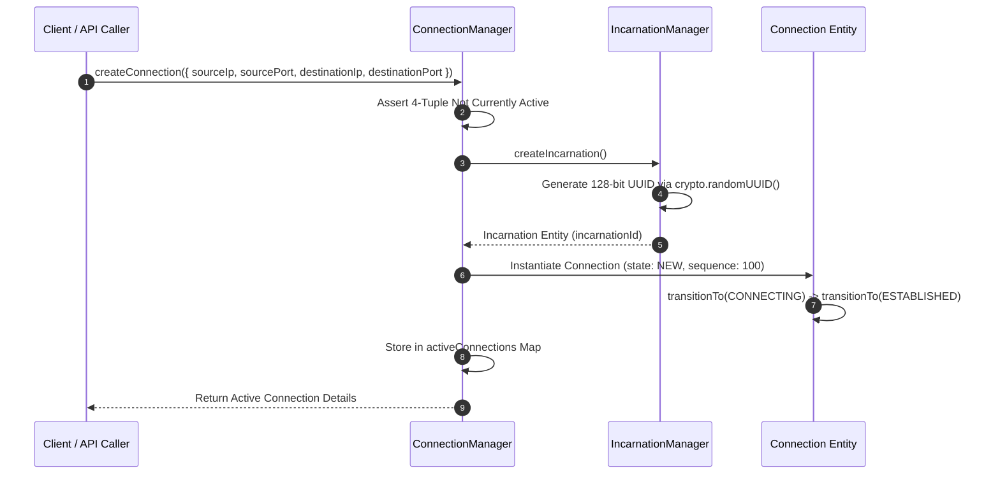
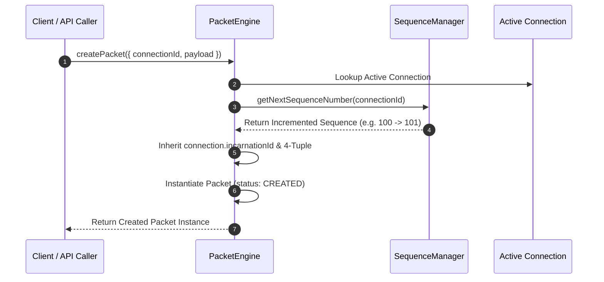
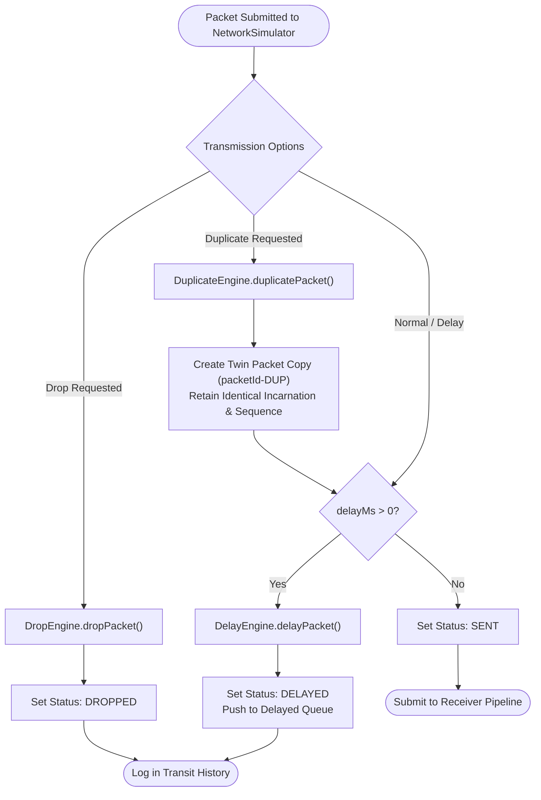
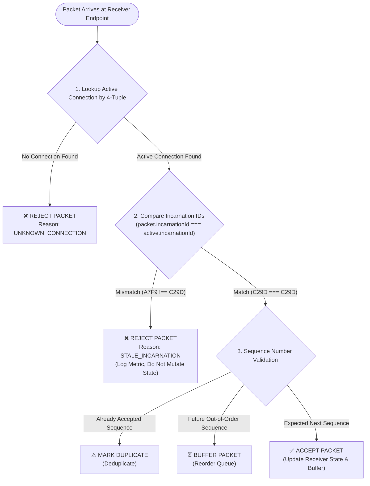

# 🔄 Complete Execution & Telemetry Flow Guide — PortShadow

This document provides step-by-step visual and operational flow diagrams for packet handling, connection state transitions, network simulation, and stale incarnation isolation.

---

## 1. Connection Lifecycle & Incarnation Allocation Flow



---

## 2. Packet Generation & Sequence Assignment Flow



---

## 3. Network Simulation Pipeline Flow



---

## 4. Receiver Incarnation Isolation & Stale Packet Rejection Flow



---

## 5. Rapid Endpoint Reuse Scenario Execution Flow

```text
Time  Event Description                                     Incarnation ID   Status
──────────────────────────────────────────────────────────────────────────────────────
T1    Connection A Created (10.0.0.1:5000 -> 8080)        A7F91C2D         ESTABLISHED
T2    Packet A1 Sent & Received                             A7F91C2D         ACCEPTED
T3    Packet A2 Sent (Held in DelayEngine for 5s)           A7F91C2D         DELAYED
T4    Packet A3 Sent & Received                             A7F91C2D         ACCEPTED
T5    Connection A Closed (4-Tuple Freed, Tombstone Saved)  A7F91C2D         CLOSED
T6    Connection B Created on EXACT SAME 4-Tuple            C29D82F1         ESTABLISHED
T7    Packet B1 Sent & Received                             C29D82F1         ACCEPTED
T8    Delayed Packet A2 Released by DelayEngine             A7F91C2D         ❌ REJECTED (STALE)
T9    Packet B2 Sent & Received                             C29D82F1         ACCEPTED
```
