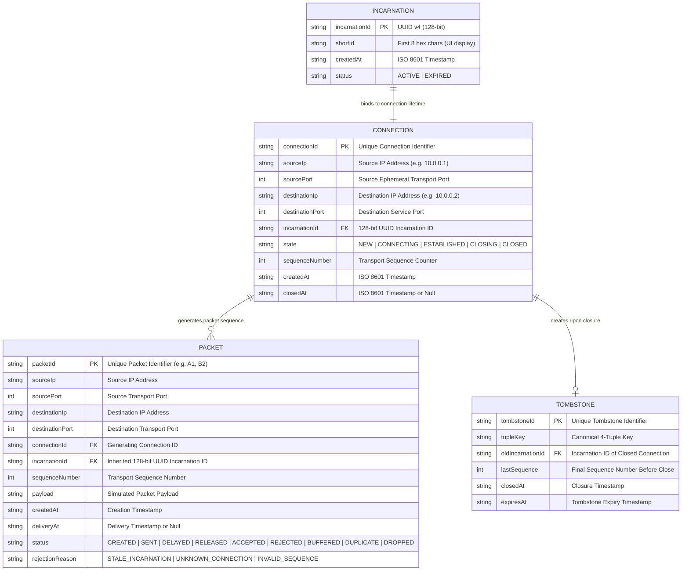

# 🛡️ PortShadow — Incarnation-Aware Transport-Layer Simulation Engine

> An incarnation-aware transport-layer simulation engine that safely isolates delayed packets from previous connection incarnations after rapid endpoint/port reuse.

---

## Table of Contents

- [1. Architecture Overview & Diagrams](#1-architecture-overview--diagrams)
  - [A. High-Level System Architecture](#a-high-level-system-architecture)
  - [B. Data Model & Entity Structure](#b-data-model--entity-structure)
  - [C. Deterministic Incarnation Isolation Sequence](#c-deterministic-incarnation-isolation-sequence)
- [2. Core Validation Engine & Precedence Rules](#2-core-validation-engine--precedence-rules)
- [3. Key Architectural Patterns](#3-key-architectural-patterns)
- [4. Environment Variables Configuration](#4-environment-variables-configuration)
- [5. Local Development Setup Guide](#5-local-development-setup-guide)
- [6. Project Directory Structure](#6-project-directory-structure)
- [7. REST API Reference](#7-rest-api-reference)
- [8. Pre-Configured Edge-Case Simulation Scenarios](#8-pre-configured-edge-case-simulation-scenarios)
- [License](#license)

---

## 1. Architecture Overview & Diagrams

PortShadow models high-connection-rate transport endpoints (IP:Port tuples) where rapid port reuse can cause delayed network packets from previous connection incarnations to arrive at a newly bound connection on the identical 4-tuple.

The simulator introduces an explicit **128-bit Incarnation ID** (`crypto.randomUUID()`) bound to every connection lifetime, ensuring that incoming packets are validated for active incarnation match before mutating receiver state.

### A. High-Level System Architecture

```text
┌────────────────────────────────────────────────────────────────────────┐
│                        React + Vite Dashboard                          │
│                (Visualizes Connections, Packets, Logs)                 │
└───────────────────────────────────┬────────────────────────────────────┘
                                    │ WebSockets (Socket.IO) & REST API
┌───────────────────────────────────▼────────────────────────────────────┐
│                    Node.js + Express Server Engine                     │
│                                                                        │
│  ┌───────────────────────────┐      ┌──────────────────────────────┐  │
│  │     ConnectionManager     │      │      IncarnationManager      │  │
│  │ (Lifecycle & 4-Tuple Map) │      │ (128-bit UUID Gen & Check)   │  │
│  └─────────────┬─────────────┘      └──────────────┬───────────────┘  │
│                │                                   │                  │
│  ┌─────────────▼─────────────┐      ┌──────────────▼───────────────┐  │
│  │       PacketEngine        │      │       SequenceManager        │  │
│  │ (Factory & Status Engine) │      │ (Per-Connection Seq Numbers) │  │
│  └─────────────┬─────────────┘      └──────────────┬───────────────┘  │
│                │                                   │                  │
│  ┌─────────────▼───────────────────────────────────▼───────────────┐  │
│  │                      NetworkSimulator                           │  │
│  │       (DelayEngine, ReorderEngine, DuplicateEngine, Drop)       │  │
│  └─────────────────────────────────────────────────────────────────┘  │
└────────────────────────────────────────────────────────────────────────┘
```

### B. Entity-Relationship (ER) Diagram & Data Model



#### Primary Entity Definitions

| Entity | Description | Key Attributes |
|---|---|---|
| **Incarnation** | Represents a single connection generation lifetime. | `incarnationId` (128-bit UUID v4), `shortId`, `status` |
| **Connection** | Simulated transport connection endpoint state. | `connectionId`, 4-Tuple (`sourceIp`, `sourcePort`, `destinationIp`, `destinationPort`), `incarnationId`, `state` |
| **Packet** | Simulated transport packet carrying generation identity. | `packetId`, `incarnationId` (inherited), `sequenceNumber`, `status`, `rejectionReason` |
| **Tombstone** | Historical record retained after connection teardown to detect late-arriving packets during rapid reuse. | `tombstoneId`, `tupleKey`, `oldIncarnationId`, `lastSequence`, `expiresAt` |

### C. Deterministic Incarnation Isolation Sequence

```text
Connection A (Incarnation A7F91C2D)             Receiver (10.0.0.1:5000 -> 10.0.0.2:8080)
      │                                                           │
      ├────── Packet A1 [Seq 100, Incarnation A7F9] ─────────────►│ ACCEPTED
      ├────── Packet A2 [Seq 101, Incarnation A7F9] ─┐            │
      │                                            │ (DELAYED)    │
      ├────── Packet A3 [Seq 102, Incarnation A7F9] ─────────────►│ ACCEPTED
      │                                                           │
Connection A Closes ──────────────────────────────────────────────┤ 4-Tuple Free
                                                                  │
Connection B (Incarnation C29D82F1) Reuses 4-Tuple               │
      │                                                           │
      ├────── Packet B1 [Seq 200, Incarnation C29D] ─────────────►│ ACCEPTED
      │                                                           │
Network Releases Delayed Packet A2 ──────────────────────────────►│ ❌ REJECTED (STALE_INCARNATION)
      │                                                           │ (A7F9 !== C29D)
      ├────── Packet B2 [Seq 201, Incarnation C29D] ─────────────►│ ACCEPTED
```

---

## 2. Core Validation Engine & Precedence Rules

PortShadow validates incoming simulated network traffic through a strict multi-tier evaluation pipeline before allowing any packet to modify receiver state.

```text
Incoming Packet
      │
      ▼
[ Tier 1: 4-Tuple Lookup ]
      │
      ├── No Active Connection Found ──────► REJECT (Reason: UNKNOWN_CONNECTION)
      │
      ▼
[ Tier 2: Incarnation ID Verification ]
      │
      ├── Packet Incarnation !== Active Incarnation ──► REJECT (Reason: STALE_INCARNATION)
      │
      ▼
[ Tier 3: Sequence Number & Ordering ]
      │
      ├── Already Accepted Sequence ───────► MARK DUPLICATE (Deduplicated)
      ├── Out-of-Order Sequence ───────────► BUFFER (Reorder Buffer)
      │
      ▼
[ ACCEPT & UPDATE RECEIVER STATE ]
```

### Primary Invariant
> **A packet belonging to an earlier connection incarnation must never modify the state of the active connection incarnation.**

---

## 3. Key Architectural Patterns

1. **128-bit UUID Incarnation Isolation**: Every connection receives a cryptographically random 128-bit UUID (`crypto.randomUUID()`). Packets generated by that connection inherit the UUID. When the connection closes and the 4-tuple is reused, the new connection receives a completely distinct 128-bit UUID.
2. **Immediate Endpoint / Port Reuse**: Closing a connection frees the active 4-tuple mapping instantly, simulating rapid port recycling without waiting for prolonged OS socket cleanup delays.
3. **No State Mutation Prior to Validation**: Stale packets arriving at a reused endpoint trigger audit metric logging and rejection without altering the receiver's sequence numbers, buffers, or connection state.
4. **Stale vs. Out-of-Order Differentiation**: Out-of-order packets belonging to the *current* incarnation are buffered, whereas delayed packets from a *previous* incarnation are discarded as stale.

---

## 4. Environment Variables Configuration

PortShadow maintains isolated environment files for both backend server and frontend client modules to enforce strict component boundaries.

> [!IMPORTANT]
> Never commit `.env` files with secret keys or production credentials to source control. `.env.example` templates are provided in each subfolder.

### Server (`server/.env`)

| Variable | Required | Description | Example |
|---|---|---|---|
| `PORT` | Yes | Express REST API server port | `5005` |
| `CLIENT_URL` | Yes | Allowed CORS origin URL for client | `http://localhost:5173` |
| `NODE_ENV` | Yes | Environment mode (`development` / `production` / `test`) | `development` |

### Client (`client/.env`)

| Variable | Required | Description | Example |
|---|---|---|---|
| `VITE_API_URL` | Yes | Backend REST API endpoint URL | `http://localhost:5005` |
| `VITE_PORT` | Yes | Vite development server port | `5173` |

---

## 5. Local Development Setup Guide

### Prerequisites
- **Node.js**: `v18.0.0` or higher (Tested on Node.js `v26.8.1`)
- **npm**: `v9.0.0` or higher

### Step 1: Clone Repository & Setup Environment Files
```bash
# Clone the repository
git clone https://github.com/Sridharsri67/PortShadow.git
cd PortShadow

# Setup server environment file
cat <<EOT > server/.env
PORT=5005
CLIENT_URL=http://localhost:5173
NODE_ENV=development
EOT

# Setup client environment file
cat <<EOT > client/.env
VITE_API_URL=http://localhost:5005
VITE_PORT=5173
EOT
```

### Step 2: Install Workspace Dependencies
```bash
# Install all dependencies across server and client workspaces
npm install
```

### Step 3: Run Automated Unit & Integration Tests
```bash
# Run test suite via Vitest
npm test
```

### Step 4: Run Development Servers
```bash
# Option A: Start both Backend API and Frontend Client concurrently
npm run dev

# Option B: Run individually
npm run dev:server   # Express API running on http://localhost:5005
npm run dev:client   # Vite React UI running on http://localhost:5173
```

---

## 6. Project Directory Structure

```text
PortShadow/
├── AGENT.md                      # Comprehensive Technical Specifications & Plan
├── README.md                     # Master Architecture Handbook & Documentation
├── package.json                  # Monorepo Workspace Configuration
├── vitest.config.js              # Vitest Test Suite Configuration
│
├── server/
│   ├── .env                      # Isolated Server Environment Variables
│   ├── .env.example              # Server Environment Variable Template
│   ├── .gitignore                 # Backend-specific Git Ignore Rules
│   ├── package.json              # Server Package Dependencies
│   └── src/
│       ├── api/
│       │   └── routes.js         # REST API Routes (Connections, Packets, Reset)
│       ├── core/
│       │   ├── ConnectionManager.js   # Active/Historical Connection Management
│       │   ├── IncarnationManager.js  # 128-bit UUID Incarnation Generator & Check
│       │   ├── PacketEngine.js        # Packet Factory & History Engine
│       │   ├── SequenceManager.js     # Per-Connection Transport Sequence Tracker
│       │   └── index.js               # Core Barrel Export
│       ├── models/
│       │   ├── Connection.js     # Connection Entity & Lifecycle State Machine
│       │   ├── Incarnation.js     # 128-bit UUID Incarnation Entity
│       │   ├── Packet.js          # Packet Entity, Statuses & Rejection Reasons
│       │   └── index.js           # Models Barrel Export
│       ├── websocket/
│       │   └── socket.js          # Socket.IO Real-Time Telemetry Gateway
│       └── server.js              # Express Server Entrypoint
│
├── client/
│   ├── .env                      # Isolated Client Environment Variables
│   ├── .env.example              # Client Environment Variable Template
│   ├── .gitignore                 # Frontend-specific Git Ignore Rules
│   ├── index.html                # HTML5 Main Entrypoint
│   ├── package.json              # Client Package Dependencies
│   ├── vite.config.js            # Vite Bundler & Proxy Configuration
│   └── src/
│       ├── App.jsx               # React Main Dashboard Component
│       ├── index.css             # Glassmorphism Design System & CSS Rules
│       ├── main.jsx              # React DOM Mount Entrypoint
│       ├── components/           # UI Sub-components Directory
│       ├── hooks/                # Custom React Hooks Directory
│       ├── pages/                # Page Components Directory
│       ├── services/             # API Client Layer Directory
│       └── store/                # UI State Store Directory
│
└── tests/
    └── unit/
        ├── connectionManager.test.js  # Connection Lifecycle & Rapid Reuse Tests
        ├── incarnation.test.js        # 128-bit UUID Incarnation & Format Tests
        ├── packet.test.js             # Packet Engine & Sequence Inheritance Tests
        └── setup.test.js              # Setup & Health Verification Test
```

---

## 7. REST API Reference

### System & Health
- `GET /api/status` — Get engine operational health, current phase, and active counters.

### Connection Lifecycle Management
- `GET /api/connections` — Retrieve list of currently active connections.
- `GET /api/connections/all` — Retrieve historical list of all connections (active + closed).
- `GET /api/connections/:id` — Retrieve connection details by connection ID.
- `POST /api/connections` — Create connection (binds fresh 128-bit `incarnationId` to 4-tuple).
- `POST /api/connections/:id/close` — Close connection and free 4-tuple endpoint for rapid reuse.
- `POST /api/connections/:id/transition` — Manually step connection lifecycle (`NEW` $\rightarrow$ `CONNECTING` $\rightarrow$ `ESTABLISHED`).

### Packet Engine Operations
- `GET /api/packets` — Retrieve all generated simulated packets.
- `GET /api/packets/:id` — Get packet details by packet ID.
- `GET /api/packets/connection/:connectionId` — Retrieve all packets sent by a specific connection.
- `POST /api/packets` — Create and send a simulated packet inheriting connection's `incarnationId`.

### Simulation Control
- `POST /api/reset` — Reset all connection state, sequence numbers, and packet history.

---

## 8. Pre-Configured Edge-Case Simulation Scenarios

| Scenario | Target Edge-Case Description |
|---|---|
| `delayed-packet` | Simulates packet $A2$ being delayed in the network while Connection A closes, Connection B reuses the 4-tuple, and $A2$ arrives with stale `incarnationId`. |
| `rapid-reuse` | Simulates immediate 4-tuple recycling (`10.0.0.1:5000 -> 10.0.0.2:8080`) showing distinct `incarnationId` generation. |
| `retransmission` | Distinguishes legitimate retransmissions of current incarnation packets from stale delayed packets. |
| `reordering` | Demonstrates out-of-order buffering for current incarnation vs rejection for stale incarnation. |
| `duplicate-packet` | Tests sequence deduplication for duplicated packets within the active connection lifetime. |

---

## License

Distributed under the MIT License. See `LICENSE` for details.
